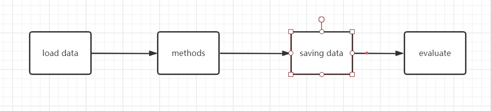

# AutomatedTesting2020

选题方向：
***

`算法释义，所用第三方库及版本，程序入口，程序结构……`
## 1 目录
代码包简介
### 1.1 Data
Data 目录下存储所有数据和扩增后的数据
注：存储的数据格式为调用numpy.savez方法存储的，打开需要使用相应的numpy.load方法。

/Data/cifar-10-batches-py:  原始数据集
/Data/cifar-100-python:     原始数据集
/Data/cifar10_result_data:  训练后数据集
/Data/cifar100_result_data: 训练后数据集
/Data/operation_data_png_cifar100: 展示不同的方法处理之后对图片产生了什么样的影响（图片示例）
---
### 1.2 Project

demo.py 是主入口，调用其它函数的各个方法。
eval.py 使用模型评估数据（验证测试正确率）
load.py 加载文件
methods.py 是不同的图像处理方法
visialize.py 可视化的相关代码

## 2 第三方库
tensorflow:2.3.1
keras:2.4.3
numpy:1.18.5
python:3.7.0

## 3 程序结构
